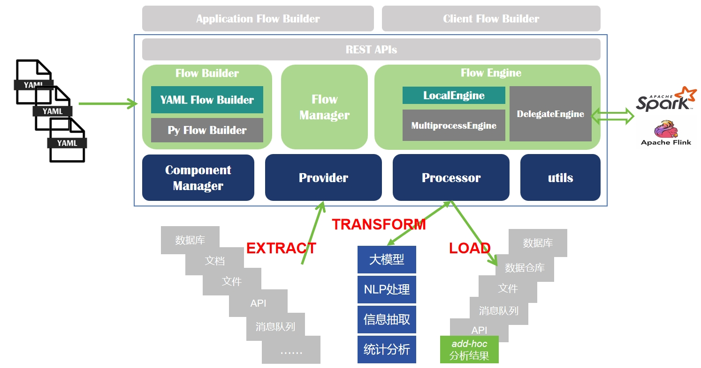

SmartETL：一个简单实用、灵活可配、开箱即用的Python数据处理（ETL）框架，提供**Wikidata** / **Wikipedia** / **GDELT**等多种开源情报数据的处理流程；
支持**大模型**、**API**、常见文件、数据库等多种输入输出及转换处理，支撑各类数据集成接入、大数据处理、离线分析计算、AI智能分析、知识图谱构建等任务。

项目内置50+常用流程、200+常用ETL算子、10+领域特色数据处理流程，覆盖常见数据处理需求，快来尝试一下吧~~~

系统架构图：


## 项目特色
1. 灵活可配的**YAML**流程定义：通过YAML文件**低/无代码**组装流程，快速响应数据处理需求
2. 丰富的ETL算子**180+**：提供**数据集成治理**、**图谱构建**、**大模型**、**NLP**、**信息抽取**等常用算子
3. 开箱即用的数据流程**50+**：面向开源情报分析提供多样化流程，覆盖数据清洗、大模型/大数据预处理、知识图谱构建、机器学习数据集生成、信息抽取、技术评估预测、数据库备份等任务。开箱即用，具体在[这里](flows)查看
4. 持续积累开源情报数据资源10+，所见即所得：
   - [wikipedia 维基百科数据](main_wikipedia.py) [建立索引](flows/wikipedia/index_wikipedia.yaml) [ES索引配置](config/es-mappings/enwiki.json)
   - [wikidata 维基数据](flows/wikidata/p1_graph_simple.yaml)
   - [GDELT 谷歌全球社会事件数据库 （轮询式下载）](flows/gdelt.yaml)
   - [新闻网页数据](flows/news/p1_kafka.yaml)
   - [GTD 全球恐怖主义事件库](flows/gtd.yaml)
   - [民调数据（经济学人美国大选专题）](flows/polls.yaml)
   - [预测市场数据](flows/futures.yaml)
   - [OpenSanctions全球制裁实体名单或涉政治、犯罪与经济重点人物、公司](flows/opensanctions_peps.yaml) [样例数据](test_data/opensanctions-entities.ftm.json)
   - [联合国教科文组织项目数据](flows/unesco-projects.yaml)
   - [FourSqure全球POI数据](flows/files/file_parquet.yaml)
   - [Common Crawl网页存档数据](flows/cc.yaml)
   - [arXiv论文数据](flows/arxiv/p2_html4all.yaml)
   - [通用网站采集](flows/crawler/gen1.yaml)
   - [网站图标采集](flows/news/scan_website.yaml)
   - more...
5. 支持常见文档文件/数据文件格式读取
   - txt
   - csv
   - html
   - [Markdown](flows/files/file_markdown.yaml)（支持识别内容层级，支持提取表格、图片）
   - [pdf](flows/files/file_pdf.yaml) 
   - [docx](flows/files/file_docx.yaml)(doc, docx)
   - [eml](flows/files/file_eml.yaml)
   - Excel(xls, xlsx)
   - PPT(ppt, pptx)
   - PST
   - OST
   - OMG
   - [json](flows/files/file_json.yaml)(支持json json-line, json-array, json-free多种格式)
   - [yaml](flows/nl2poc/nuclei_http_poc_desc.yaml)
   - [parquet](flows/files/file_parquet.yaml)
6. 支持常见数据库读取和写入，覆盖常见OLTP和OLAP场景
   - MySQL
   - PostgreSQL
   - ClickHouse（列存数据库）
   - MongoDB（文档数据库）
   - ElasticSearch（全文索引）
   - Qdrant（向量数据库）
   - Kafka（消息队列）
   - SQLite

## 应用场景
本项目具有众多数据处理分析应用场景：
- 大模型数据预处理：调用大模型进行主题分类、文本翻译、Embedding处理等。参考[大模型调用示例](flows/llm/siliconflow.yaml) [新闻处理](flows/news/p2_text.yaml)
- 信息抽取与NLP处理：网页信息抽取、新闻主题分类、新闻地区识别、文档专门解析。参考[网页信息抽取](flows/news/p1_kafka.yaml) [新闻处理](flows/news/p2_text.yaml)
- 多模态数据处理：调用多模态embedding对图像进行Embedding处理 参考[图像索引](flows/news/index_image.yaml)
- 机器学习/数据挖掘数据集构建：漏洞PoC数据库构建、基于大模型的知识蒸馏、科技评估预测等。参考[poc构建](flows/nl2poc/nuclei_http_poc_desc.yaml)
- 开源数据采集：[GDELT全球事件](flows/gdelt.yaml)、Web API数据集成、[网页URL数据采集](flows/crawler/gen1.yaml)，JsonP数据解析，[图片采集](flows/news/p2_image.yaml)等
- 开源数据处理：wikidata维基数据、维基百科、新闻、图片等数据处理。参考[wikidata处理](flows/wikidata/p1_base.yaml) [GDELT数据采集](flows/gdelt.yaml) 
- 知识图谱构建：基于结构化数据和非结构化数据的实体抽取、关系抽取、事件抽取等（部分算子待完善） 。参考[wikidata知识图谱](flows/wikidata/p3_relation_of_human.yaml) 关于wikidata知识图谱的介绍，可以参考作者的一篇博客文章 https://blog.csdn.net/weixin_40338859/article/details/120571090
- 数据分析：针对Excel、Parquet等表格数据的转换、过滤、去重、统计等。参考[项目数据统计1](flows/unesco-projects.yaml) [项目数据统计2](flows/unesco-projects-aggs.yaml)
- 数据库管理/DBA：数据库备份、同步、查询分析等。参考[ClickHouse导出](flows/dba/db_ck_export.yaml) [MongoDB数据迁移](flows/dba/db_mongo_transfer.yaml)
- 服务监测：定时轮询API/服务状态等。参考[数据监测](flows/api_monitor.yaml)

## New！
- 2025.5.26
1. 实现图片扫描、生成特征ID、建立索引流程 [本地图片处理](flows/news/index_image.yaml) 
2. 实现对本地arxiv论文html/PDF解析流程 [论文下载](flows/arxiv/task_download.yaml) [arXiv论文解析](flows/arxiv/task_process.yaml)
3. 完善了 ElasticSearch、MinIO、Qdrant数据库组件

- 2025.4.24
1. 实现[通用爬虫采集流程](flows/crawler/gen1.yaml)，基于提供的网站地址，不断发现链接并采集内容，提取标题和正文

- 2025.4.20
1. 完善arxiv论文采集处理流程

- 2025.4.12
1. **重要更新** 重构数据库相关组件，统一数据库操作导`util.database`模块中，Loader和Processor组件根据需要与特定数据库组件进行绑定 如`database.Scroll(mongo)`实现MongoDB数据库的数据读取
2. 新增`SQLite`数据库组件
3. 数据库操作相关流程全部更新
4. 基于新的逻辑gestata实现arXiv论文的搜索、抽取、图片下载等，查看[详情](wikidata_filter/gestata/arxiv.py)

## 核心概念
- Flow: 处理流程，实现数据载入（或生成）、处理、输出的过程，通过`yaml`文件定义
- Provider/Loader：数据加载节点（对应flume的`source`） 
- Processor/Iterator：数据处理节点，用于表示各种各样的处理逻辑，包括数据输出与写入数据库（对应flume的`sink`）
- Engine：按照Flow的定义进行执行。简单Engine只支持单线程执行。高级Engine支持并发执行，并发机制通用有多线程、多进程等

## 快速使用
1. 安装基本依赖
```shell
 pip install -r requirements.txt
```

2. 查看帮助
```shell
 python main_flow.py -h
```


3. 启动流程

- 方式一：基于**命令行CLI**运行：
```shell
 python main_flow.py --loader "String(arg1, sep=';')" --processor "Print" local "1;2;3"
```

- 方式二：基于**YAML流程定义**运行：
```shell
 python main_flow.py flows/test.yaml
```

可以在[这里](flows)找到很多开箱即用的流程。[查看Yaml定义规范](docs/yaml-flow.md)

- 方式三：基于**Python代码**运行：
以下示例与([test.yaml](flows/test.yaml)等价：
```python
from wikidata_filter.flow_engine import run
from wikidata_filter.loader import JsonLine
from wikidata_filter.iterator import Print, Count, Chain, Fork, Select, AddFields

# 定义节点

# 定义数据源  新闻数据
loader = JsonLine('test_data/news.jsonl')

# 选择id和url两个字段
select = Select('id', 'url')
# 添加一个字段chain，值为1，然后打印
chain1 = Chain(AddFields(chain='1'), Print())
# 添加一个字段chain，值为2，然后打印
chain2 = Chain(AddFields(chain='2'), Print())

# 定义整体处理流程
processor = Chain(select, Fork(chain1, chain2, copy_data=True))

# 执行流程
run(loader, processor)
```


## CLI流程示例
1. 加载`EarthCam`jsonp数据
```shell
python .\main_flow.py --loader "web.jsonp.Jsonp('https://www.earthcam.com/cams/common/gethofi
tems.php?hofsource=com&tm=ecn&camera=all&start=0&length=21&ec_favorite=0&cdn=0&date_start=undefined&date_end=undefined&id=&callback=onjsonpload')" --processor "Chain(SelectVal('hofdata'), Flat(), Print())" list1
```

2. 加载`EarthCam`摄像头搜索结果，显示摄像头名字
```shell
python .\main_flow.py --loader "web.api.Get('https://www.earthcam.com/api/mapsearch/get_locations?nwx=37.38509688580934&nwy=-126.40319824218751&nex=37.38509688580934&ney=-109.18212890625001&sex=29.95662353271325&sey=-109.18212890625001&swx=29.95662353271325&swy=-126.40319824218751&zoom=9')" --processor "Chain(Flat(), SelectVal('places'), Flat(), SelectVal('name'), Print())" test1
```


## YAML流程定义示例

Tips：可先查看已有流程，看是否有相关任务的，尽量基于已有流程修改。

- 示例1：加载联合国教科文组织的项目清单CSV文件，按受益国家分组，统计项目数量、总预算、总支出 [查看详情](flows/unesco-projects-aggs.yaml) [流程对比](flows/unesco-projects.yaml)

```yaml
loader: CSV('test_data/unesco-projects-20241113.csv')

nodes:
  print: Print
  rename1: RenameFields(**rename)
  group: Group(by='beneficiary_country', emit_fast=False)
  g_count: aggs.Count
  g_total_budget: aggs.Sum('budget')
  g_total_cost: aggs.Sum('cumulative_cost')

processor: Chain(rename1, group, g_total_cost, print)
```

- 示例2：输入wikidata dump文件（gz/json）生成id-name映射文件（方便根据ID查询名称），同时对数据结构进行简化，[查看详情](flows/wikidata/p1_base.yaml)
```yaml
name: p1_idname_simple
arguments: 1

loader: WikidataJsonDump(arg1)

nodes:
  n1: wikidata.IDNameMap
  n2: WriteJson('data/id-name.json')
  n3: wikidata.Simplify
  n4: wikidata.SimplifyProps
  n5: WriteJson('test_data/p1.json')
  chain1: Chain(n1, n2)
  chain2: Chain(n3, n4, n5)

processor: Fork(chain1, chain2)
```

- 示例3：基于wikidata生成简单图谱结构，包含Item/Property/Item_Property/Property_Property四张表 [查看详情](flows/wikidata/p1_graph_simple.yaml)
```yaml
name: p1_wikidata_graph
description: transform wikidata dump to graph, including item/property/item_property/property_property
arguments: 1

loader: WikidataJsonDump(arg1)

nodes:
  writer1: WriteJson('test_data/item.json')
  writer2: WriteJson('test_data/property.json')
  writer3: WriteJson('test_data/item_property.json')
  writer4: WriteJson('test_data/property_property.json')

  rm_type: RemoveFields('_type')

  entity: wikidata.Entity
  filter_item: matcher.SimpleMatch(_type='item')
  filter_property: matcher.SimpleMatch(_type='property')
  chain1: Chain(filter_item, rm_type, writer1)
  chain2: Chain(filter_property, rm_type, writer2)
  group1: Fork(chain1, chain2)

  property: wikidata.Property
  filter_item_property: matcher.SimpleMatch(_type='item_property')
  filter_property_property: matcher.SimpleMatch(_type='property_property')
  chain3: Chain(filter_item_property, rm_type, writer3)
  chain4: Chain(filter_property_property, rm_type, writer4)
  group2: Fork(chain3, chain4)

  chain_entity: Chain(entity, group1)
  chain_property: Chain(property, group2)

processor: Fork(chain_entity, chain_property)
```

## 使用者文档 User Guide

YAML Flow [Flow 格式说明](docs/yaml-flow.md)

数据加载器 [Loader 说明文档](docs/loader.md)

处理节点（过滤、转换、输出等） [Iterator 说明文档](docs/iterator.md)


## 开发者文档 Developer Guide

详细设计说明[设计文档](docs/main-design.md)

Flow流程配置设计[可配置流程设计](docs/yaml-flow-design.md)

## 开发日志
- 2025.3.29
1. 集成并改造王宁的arxiv下载处理流程

- 2025.3.10
1. 新增`MySQL`数据库全量导出备份流程[查看详情](flows/dba/mysql_export.yaml)
2. 完善新闻网页时间抽取逻辑 [查看详情](wikidata_filter/util/extractor/html.py)

- 2025.3.8
1. 新增`Markdown`格式解析为json层级结构，支持提取表格
2. 新增`arXiv`论文下载

- 2025.3.4
1. 实现Common Crawl WARC/WAT/WET文件解析，参考 https://commoncrawl.org/get-started

- 2025.2.28
1. 实现命令行参数--loader --processor覆盖flow文件

- 2025.2.26
1. 更新[Deep Search流程](flows/agent/deepsearch.yaml)
2. 实现Prompt构造工具 `util.prompt.Config` （大模型应用关键组件：Prompt构造、大模型调用、结果解析）
3. 实现基于数据库的去重算子 `DistinctByDatabase` #17

- 2025.2.25
1. **重磅！** 实现流程控制节点 `If` `IfElse` `While` 根据条件进行分支选择。见 [示例流程](flows/demos/ifelse.yaml)
2. 重构模型系列组件，拆分提示构造`util.prompt`、模型调用`modelv2.base.Model`、结果解析`util.parser`等组件，与流程节点`modelv2.processor`分离。[示例流程](flows/agent/deepsearch.yaml)
3. 增加字符串处理算子 `util.strings.f(method)`
4. 新增[Deep Search流程](flows/agent/deepsearch.yaml) 参考：https://github.com/zilliztech/deep-searcher
5. 新增[网站icon图标文件采集流程](flows/news/scan_website.yaml)

- 2025.2.23
1. 新增`sink.Collect` `sink.Sort`算子，对流程处理数据进行收集、排序（注意：仅适合小规模数据）
2. 新增流程 flows/nl2poc/poc-meta-product-stat.yaml 对`nuclei`模板进行统计
3. [DeepSeek大模型调用流程](flows/llm/deepseek_r1.yaml) 增加读取整个文件内容作为`prompt`调用到模型的例子

- 2025.2.17
1. 优化新闻信息抽取组件，基于meta及ld-json信息抽取
2. 新增`WriteJsonScroll`进行滚动备份，新增`WriteJsonIf`进行过滤式数据备份

- 2025.2.13
1. 新增腾讯云DeepSeek `model.deepseek.DeepSeek_LKEAP(api_key)` 
2. 提供[测试流程](flows/llm/deepseek_r1.yaml) 使用腾讯云DeepSeek模型进行推理测试，执行：`python main_flow.py flows/llm/deepseek_r1.yaml`
3. 修改大模型算子基类`model.base.LLM` 支持stream参数，通过设置stream=True实现流式生成，终端连续打印大模型生成结果

- 2025.2.9
1. 对接DeepSeek `model.DeepSeek(api_key, key, prompt='prompt')` 
2. 基于DeepSeek实现文本实体识别。[详情](flows/llm/ner.yaml) 修改`model.LLM`的构造参数 配置api_key即可运行

- 2025.2.8
1. 修改GDELT数据请求策略，尝试30次无效后则跳过
2. 完善[loader文档](docs/loader.md)
3. 新增[数据源文档](docs/datasource.md)

- 2025.1.14
  - 新增[图片采集流程](flows/news/p2_image.yaml)及相关算子，查找新闻网页中的图片并下载图片，保存到MinIO中（代码来源：丘龙鹏）
  - 合并新闻文本处理与图片采集流程，形成[总流程](flows/news/p3_all.yaml)
  - 新增基于开源情报报告（word格式）的[解析流程](flows/news/load_news_report_doc.yaml)及相关算子

- 2025.1.12
  - 增加新闻（HTML）解析示例[查看](flows/news/parse_html.yaml)
  - 更新文档
  - 新增`web.jsonp.Jsonp(url, **params)`加载器，获取提供的jsonp-url的返回结果并解析其中的json数据
  - 调整`FromJson` `ToJson` `Format`算子到`mapper`模块

- 2025.1.9
  - 新闻时间统一处理 统一转为北京时间对应的时间戳

- 2025.1.8
  - 解决Chain节点重复问题（Pytho类的类字段问题）
  - 修改`ComponentManager`，将类对象和实例对象进行分开，并支持默认loader/processor的预加载
  - 支持在构造子中进行嵌套构造，如：`Fork(write_es, Chain(vector, write_qd))`
  - 修改`Fork`，以支持分支数据相互独立（`copy_data=True`）
  - 新增Kafka Web接口消息加载
  - 新增了两个流程：基于消息队列加载新闻并抽取内容 [查看](flows/news/p1_kafka.yaml)；对新闻进行翻译、向量化 [查看](flows/news/p2_text.yaml)

- 2024-12-26
1. 新增两个安全领域数据处理流程（基于大模型的poc描述、poc生成）
2. Fix SelectVal代码问题

- 2024.12.22
1. 梳理全部流程，修正组件引用错误
2. 流程、组件管理器及流引擎部分代码重构，命名更加清晰明确
3. 实现yaml文件的引用（`from`）

- 2024.12.21
1. 全部算子重新梳理，整理算子清单，重命名，修正部分逻辑，修改yaml文件
2. 支持命令行定义流程

- 2024.12.19
1. 新增多个有用的转换算子 `MapMulti` `MapUtil` `MapFill`，均继承自`Map`
2. `WriteText` `WriteJson`支持gzip压缩，减小文件大小、提高写文件效率
3. 框架监听SIGINT信号，在完成一条数据的完整处理后再结束程序
4. 新增获取数据库表信息的Loader `database.meta.DBTables(loader)` 基于已有的数据库Loader（如`database.mysql.MySQL`）获取表信息
5. 修改`database.mysql.MySQL`支持游标读取，从而支持大规模数据库表的数据读取
6. 修改`database.rdb_base.RDBBase`，对于不带limit的查询，使用游标方式读取数据，以支持超大规模数据表读取（对于小表，使用`fetchall`方式，其效率待测试对比）

- 2024.12.18
1. 面向LD项目新增算子及流程，[查看](flows/technology_score.yaml) 
2. 通过`landinn.node.Nodes`自定义加载模块加载器，实现数据灵活转换

- 2024.11.30
1. 新增EML文件加载器 `eml.EML(input_file, tmp_dir=None, save_attachment=True)`提取邮件主题、发件人、收件人、抄送、密送、时间、其他邮件头、正文、附件
2. 新增pptx文件加载器 `ppt.PPTX(input_file, max_pages=0)` 基于python-pptx读取pptx文件，ppt则先通过libreoffice转换为pptx，每个段落（文本框）作为一条数据

- 2024.11.28
1. 新增PDF文件加载器 `pdf.PDF(input_file, max_pages=0)` 基于PDFMiner读取PDF文件，每页文本作为一条数据
2. 新增Word doc/docx文件加载器 `docx.Doc(input_file)` `docx.Docx(input_file)` 基于python-docx读取docx文件，doc则先通过libreoffice转换为docx，每个段落、表格作为一条数据
3. 新增Parquet文件加载器 `parquet.Parquet(input_file)` 基于pyarrow读取parquet文件，每行作为一条数据
4. 对应增加三个示例流程：[pdf文件加载](flows/file_pdf.yaml) [docx文件加载](flows/file_docx.yaml) [parquet文件加载](flows/file_parquet.yaml)

- 2024.11.24
1. 新增`wikidata_filter.test`模块，作为框架扩展示例：通过在`wikidata_filter`中添加引用，可引入外部扩展模块，从而实现项目集成

- 2024.11.23
1. 新增`aggs`算子模块，提供基本的聚合统计功能，配合`Group`使用。包括`Reduce` `ReduceBy` `Count` `Sum` `Mean` `Min` `Max` `Std` `Var`
 以及 `Head` `Tail` `Sample` `Distinct` `OrderBy`等
2. 新增`sample.Distinct` 以支持去重，可重写其`exists(val)`方法实现更加高级的重复数据判别


- 2024.11.21
1. 新增采样算子`Sample(rate=0.01)` 对数据进行采样

- 2024.11.19
1. 新增文件夹加载器`Directory(paths, *suffix, recursive=False, type_mapping=None, **kwargs)` 根据文件后缀名调用具体的加载器进行加载（.txt .json .jsonl .jsonf .jsona .xls）
2. 新增[文件夹处理流程](flows/files/file_directory.yaml)
3. 修改Flat处理逻辑

- 2024.11.17
1. `JsonIterator`增加`__process__(data)`方法，如果需要接收特殊消息（如结束END/定时TIMEOUT/刷新FLUSH），则重写此方法。默认逻辑为如果data不为None，调用`on_data`进行具体数据处理。
2. 流程中不需要显示生命finish_sinal，`run`在数据结束后自动发送一个特殊消息`Message.end()`
3. 为大部分组件添加`__str__`实现 方便展示组件对象信息
4. 新增联合国教科文组织项目数据处理流程[查看](flows/unesco-projects.yaml)及相关[测试数据](test_data/unesco-projects-20241113.csv)

- 2024.11.16
1. 重写 `Chain`处理逻辑，可作为普通节点提供输出；判断每个子节点输出，如果是生成器，则用for获取
2. 重写`run`方法，针对部分处理节点的`on_data`方法可能包含`yield`（对应返回为生成器），对结果进行判断
3. 新增[`openapi`JSON文件](test_data/opensanctions-openapi.json)结构解析算子 `iterator.web.openapi.FromOpenAPI`和`iterator.web.openapi.ToOpenAPI`
4. 新增**OpenSanctions**FTM数据格式的人员`Person`转换流程[查看](flows/opensanctions_peps.yaml)
5. 新增属性提升处理算子 `FlatProperty(*keys, inherit_props=False)` 返回特定字段的值

- 2024.11.09
1. 新增文本分段算子 `nlp.splitter.TextSplit(key, target_key, algorithm='simple')` 实现文本chunk化，便于建立向量化索引。chunk算法持续扩展
2. 新增qdrant数据库算子 `database.Qdrant(host: str = 'localhost', port: int = 6333, api_key=None, collection: str = "chunks", buffer_size: int = 100, vector_field='vector')`
3. 新增向量化算子 `model.embed.Local(api_base: str, field: str, target_key: str = '_embed')` 调用向量化服务实现对指定文本字段生成向量。下一步实现OpenAI接口的向量化算子
4. 修改[新闻处理流](flows/news/llm_process_news.yaml)，增加分段->向量化->写入qdrant的处理节点

- 2024.11.04
1. 新增轮询加载器`TimedLoader(loader)` 可基于一个已有的加载器进行定时轮询 适合数据库轮询、服务监控等场景
2. 新增URL加载器`web.api.URLSimple(url)` 接口返回作为JSON数据传递
3. 修改`flow_engine` 实现nodes中定义loader （节点名以"loader"开头）
4. 新增流程[查看](flows/api_monitor.yaml) 实现对URL接口持续监控

- 2024.11.01
1. 增加工具模块 `util.dates`，可获取当前时间`util.dates.current()`(秒) `util.dates.current_date()`（字符串） `util.dates.current_ts()`（毫秒）
2. 增加工具模块 `util.files`，读取文本文件 `util.files.read_text(filename)`
3. 增加Loader `JsonFree` 读取格式化JSON文件，自动判断json对象边界
4. 简化几个Loader的命名：`Text` `Json` `JsonLine` `JsonArray` `CSV` `Excel` `ExcelStream`

- 2024.10.28
1. 合并`Converter`、`FieldConverter`到`Map`算子，支持对字段进行转换，支持设置目标字段
2. 修改`Select`以支持嵌套字段`user.name.firstname`形式
3. 新增天玑大模型接口调用`GoGPT(api_base,field,ignore_errors,prompt)`
4. 新增一个[新闻处理流程](flows/news/llm_process_news.yaml) 通过提示大模型实现新闻主题分类、地名识别并并建立ES索引
5. 新增文本处理算子模块 `iterator.nlp` 提供常用文本处理
6. 为基类`JsonIterator`增加_set链式方法，简化算子属性设置和子类实现（子类__init__不需要设置每个基类参数）比如可以写：`WriteJson('test_data/test.json')._set(buffer_size=50)`
7. 重新实现缓冲基类`Buffer`（具有一定大小的缓冲池）、缓冲写基类`BufferedWriter`，文本写基类`WriteText`继承`BufferedWriter`

- 2024.10.27
1. 修改`main_flow` 支持参数设置，详细查看帮助：`python main_flow.py -h` 支持通过命令行提供loader数据
2. 增加两个简单的loader组件：`ArrayProvider(arr)`、`TextProvider(txt, sep='\n')` 可参考[简单流程](flows/use_envs.yaml)
3. 简化各流程文件的参数设置 方便快速使用

- 2024.10.26
1. 新增大模型处理算子`LLM` 可调用与OpenAI接口兼容的在线大模型接口，需要提供api_base、api_key，其他参数支持：model、proxy、prompt、temp等
2. 基于`LLM`实现月之暗面（Kimi）大模型`Moonshot`、Siliconflow平台大模型`Siliconflow`大模型算子
3. 新增大模型调用流程示例[查看](flows/llm/siliconflow.yaml) 填入api_key即可执行：`python main_flow.py flows/llm_local.yaml`
4. 增加一些测试流程的测试样例数据[查看](test_data)
5. 修改`JsonMatcher`，继承`Filter`，使得匹配对象可以直接作为过滤算子（之前是作为`Filter`的参数） `matcher`移动到`iterator`下
6. 简化iterator的配置，nodes和processor定义的节点都可以不写`iterator` 如可以写`web.gdelt.Export`
7. 支持获取环境变量，在consts中声明，如`api_key: $OPENAI_KEY` 表示从环境变量中读取OPENAI_KEY的值并赋给api_key
8. 对多个流程补充描述说明

- 2024.10.25
1. 修改GDLET数据加载器`GdeltTaskEmit` 调整睡眠模式 避免访问还未生成的zip文件
2. 新增`FieldConvert(key, converter)`算子，实现对指定字段进行类型转换，转换子为任意支持一个参数的函数 如`int` `float` `str` `bool`、`util.lang_util.zh_simple`等
3. 新增`Convert(converter)`算子，实现对记录的类型转换，转换子包括`int` `float` `str` `bool`等

- 2024.10.24
1. 新增GDELT处理流程，持续下载[查看](flows/gdelt.yaml) 滚动下载export.CSV.zip文件
2. 增加新的Loader `GdeltTaskEmit` 从指定时间开始下载数据并持续跟踪
3. 新增经济学人民调数据处理算子 `iterator.web.polls.PollData` （需要手工下载CSV）、处理流程[查看](flows/polls.yaml)
4. 修改`Flat`算子逻辑，如果输入为`dict`，则提取k-v，如果v也是`dict`，则把k填入v中（_key），最后输出v

- 2024.10.17
1. 添加多个处理算子：FieldJson、Flat、FlatMap、AddFields [查看](docs/iterator.md)
2. 初步添加规约类算子：BufferBase Reduce GroupBy

- 2024.10.15
1. 修改CkWriter参数为 username tcp_port 明确使用TCP端口（默认9000，而不是HTTP端口8123）
2. 新增字段值 String -> Json 算子 `FieldJson(key)`
3. 新增加载json文件到ClickHouse流程[查看](flows/dba/db_mongo_import.yaml)
4. 新增ClickHouse表复制的流程[查看](flows/dba/db_ck_transfer.yaml)

- 2024.10.14
1. 新增 MongoWriter
2. 新增 MongoDB表复制流程[查看](flows/dba/db_mongo_transfer.yaml)

- 2024.10.02
1. WriteJson WriterCSV增加编码参数设置
2. 新增GDELT本地数据处理的简化流程[查看](flows/gdelt_local.yaml) 通过加载本地文件转化成JSON

- 2024.09.30
1. 集成Reader API（`wikidata_filter.iterator.web.readerapi` 详见 https://jina.ai/reader/)
2. 增减文本文件加载器 TxtLoader（详见 `wikidata_filter.loader.file.TxtLoader`）
3. 新增Reader API的流程 [查看](flows/web/jina.yaml) 加载url列表文件 实现网页内容获取
